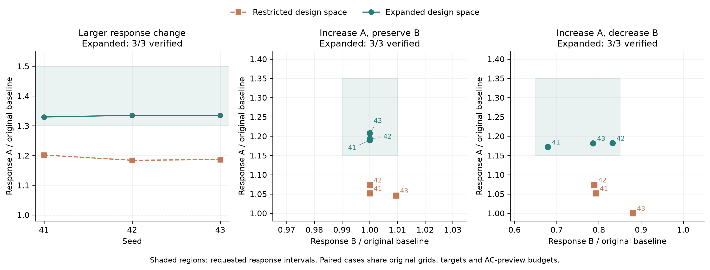

# GridGen-Agents

**Generate research power-system cases from natural-language requests or structured specifications.** Export callable OpenDSS and MATPOWER models with electrical validation records and interactive network diagrams.

[Repository](https://github.com/ZachariahZhou/GridGen-Agents) | [Architecture](docs/architecture.md) | [Usage](docs/usage.md) | [Verification](docs/verification.md)

This snapshot is **M90-response-fix-v1**, building on the three research-task workflows in M89-task-v1, with Python package version **0.1.0**. It adds bounded transmission voltage initialization, short-horizon corridor selection and coupled-target candidate ranking. The [repair evidence and manuscript addendum](docs/research/m90-response-reliability.md) records the targeted experiments and their scope. The Python package and CLI retain the name `feeder-agents`. Original code is licensed under [Apache-2.0](LICENSE); reference data and dependencies retain their own terms, documented in [THIRD_PARTY.md](THIRD_PARTY.md).

## Capabilities

- Urban and rural distribution feeders with balanced or phase-resolved unbalanced models, loads and equivalent PV injections.
- MV-transformer-LV-customer networks with overhead, buried, ducted and region-specific equipment choices.
- Single- and multi-voltage balanced AC transmission networks with generators, transformers and condition-dependent equipment selection.
- LangChain tools and LangGraph execution with requirement checks, electrical feedback, permitted repairs and rollback.
- Design-document rule extraction, project memory and repair experiences admitted after verification.
- Individual cases, batches, specified-condition target searches, a CLI and a Streamlit interface.
- Electrical-response targets: distribution voltage sensitivity and transmission AC transfer response, with guarded equipment edits and independent perturbation-step verification.
- Research-task workflows: voltage control, static PV integration impact and transmission power transfer, with frozen task contracts, finite AC experiments and auditable model exports.

The delivered objects are research network models. Continuous annual time series, dynamic simulation, protection coordination, real GIS reconstruction and general-purpose OPF or N-1 design are outside the implemented scope. Acceptance refers to the checks actually executed for the selected specification.

## Installation

Use Python 3.11 or later. Local verification used Linux; some process locks require `fcntl`. Windows users can use WSL; native Windows execution has not been validated.

```bash
python -m venv .venv
source .venv/bin/activate
python -m pip install -e '.[dev,transmission,plots]'
feeder-agents --help
```

The core distribution CLI can be installed with `pip install -e .`. Optional extras add PYPOWER/SciPy (`transmission`), Matplotlib (`plots`) and pytest (`dev`). [requirements-tested.txt](requirements-tested.txt) records tested direct dependency versions, rather than a complete cross-platform lock.

## Try it without an API key

The packaged specifications run local generators and electrical solvers without external LLM calls:

```bash
feeder-agents generate --spec examples/distribution_radial.yaml --id radial_demo
feeder-agents generate --spec examples/distribution_villages.yaml --id villages_demo
feeder-agents hierarchy --spec examples/hierarchical_urban.yaml --id urban_demo
feeder-agents transmission --spec examples/transmission_37.yaml --id transmission_demo
```

| Specification | Model | CLI command |
|---|---|---|
| [distribution_radial.yaml](examples/distribution_radial.yaml) | 25 buses, 10 kV, rural trunk and laterals | `generate` |
| [distribution_villages.yaml](examples/distribution_villages.yaml) | 37 buses, 10 kV, three villages, unbalanced phases | `generate` |
| [hierarchical_urban.yaml](examples/hierarchical_urban.yaml) | Urban 10/0.4 kV, three transformers, 24 customers | `hierarchy` |
| [hierarchical_rural.yaml](examples/hierarchical_rural.yaml) | Rural 10/0.38 kV, three transformers, 24 customers | `hierarchy` |
| [transmission_37.yaml](examples/transmission_37.yaml) | 37 buses, 110 kV | `transmission` |
| [transmission_139.yaml](examples/transmission_139.yaml) | 139 buses, 500 kV | `transmission` |
| [transmission_237.yaml](examples/transmission_237.yaml) | 237 buses, 500/220 kV | `transmission` |

Outputs are saved under `workspace/`. An existing run ID resumes an identical configuration; use a new ID when changing parameters. Runtime outputs are excluded from Git.

## Natural-language design and web interface

```bash
cp .env.example .env
# Set your API key, service URL and an available model name in .env.
feeder-agents design 'Generate a rural 10 kV feeder with exactly 37 buses, three villages and 480 kW total demand. Use research defaults for unspecified settings.' --id language_demo
python -m streamlit run app.py
```

Open `http://localhost:8501`. Start the application from this directory so it reads the intended `.env`. Environment variables take precedence; the next model call reloads the file. The template uses `qwen3.7-plus` as an example identifier; availability depends on your provider account.

Natural-language planning and explicitly enabled agent feedback call the configured external model. Structured example commands use local execution by default. See [usage and outputs](docs/usage.md) for details.

Public documentation, examples and interface text are in English. English and Chinese request parsing remain supported; Chinese recognition patterns and input fixtures use Unicode escapes in the published source, preserving their decoded values.

## Research-task workflows

Turn a research request into a reusable model, frozen test ports and measured suitability evidence. The loop checks both the response objective and a finite task experiment on every candidate: external Q support for voltage control, full existing-PV off/on for PV impact, or balanced MW transfer at fixed Q for transmission.

```bash
feeder-agents --workspace workspace/tasks research-design --plan examples/research_voltage_control.yaml --id voltage
feeder-agents --workspace workspace/tasks research-design --plan examples/research_static_pv_impact.yaml --id pv
feeder-agents --workspace workspace/tasks research-design --plan examples/research_transmission_transfer.yaml --id transfer
```

Use `research-design --request 'Generate a rural 10 kV feeder for voltage control with 360 kW total load and 20 kvar reactive support.' --id voltage_language` for configured-LLM compilation; `--draft` stops before generation. The standard `design` entry point and web interface also route these task requests. Explicit bus counts are retained; omitted counts use disclosed defaults. LangChain exposes `describe_research_tasks` and `design_research_grid`.

The default protocol seeks response ratios of 1.10–1.30 for voltage/PV and 0.50–0.98 for transmission. Fresh distribution synthesis permits compatible conductors and bounded uniform geometry scaling (up to 75%); fixed coordinates remove scaling. These are declared research choices, not calibrated difficulty classes or engineering standards. Custom targets and tighter permissions can be supplied. Controller design, maximum PV hosting capacity and maximum transfer capacity are separate research problems.

All nine fixed-plan examples passed response, finite-experiment and independent-step checks. Three distinct live `qwen3.7-plus` requests have completed records, with two failed voltage-request attempts retained before fixes. This is a workflow pilot across fixes, not a general or same-version first-attempt success-rate estimate. [Full method and experiment record](docs/research-task-workflows.md), [CSV](docs/assets/research_tasks_results.csv), [frozen inputs](docs/assets/research_tasks_suite.json), [live attempt ledger](docs/assets/research_tasks_live.json).


## Electrical-response-conditioned synthesis

Generate a research network with requested response intervals. Exact buses, total P/Q, each PV injection, phase assignments, voltage level and source/control settings remain protected. Geometry, connectivity and nodal demand are fixed unless the plan explicitly enables and bounds the corresponding action. Catalogue replacement, uniform scaling, local subtree scaling, radial branch reconnection and conserved load redistribution provide different design freedoms. Local changes currently require generated `spatial_mst` distribution models; rewiring excludes normally-open ties, and redistribution excludes prescribed load shapes. Explicit coordinates forbid geometry scaling.

```bash
feeder-agents response-design --plan examples/response_rural_37.yaml --id response_rural
feeder-agents response-design --plan examples/response_transmission_139.yaml --id response_tx
# Explicitly allow up to 15% spatial scaling relative to the original geometry.
feeder-agents response-design --plan examples/response_urban_25.yaml --id response_urban
# Increase response A while preserving response B; bounded local geometry.
feeder-agents response-design --plan examples/response_selective_25.yaml --id selective_demo
# Also grant explicit reconnection and load-redistribution permissions.
feeder-agents response-design --plan examples/response_flexible_25.yaml --id flexible_demo
```

Natural-language requests mentioning voltage sensitivity or electrical response enter the same workflow. `search.selector: agent` enables the configured LLM to select among numerically verified improvements; `heuristic` uses deterministic selection. The original response denominator stays fixed. The final model must also pass a separate half-step check. Unmet targets are reported explicitly; bounded-search failure is not proof of infeasibility.

Version 3 permits broader numerical edit bounds, previews up to two combined moves and proposes compensating changes for protected response ports. All budgets refer to the original model. Uniform scale permission can be configured up to 90%; actual edits also obey segment lengths and electrical checks. These are research design limits, not engineering standards. Transmission retains its existing parallel-circuit actions. Multi-voltage distribution response synthesis, arbitrary response matrices and dynamic response are outside this extension.

In 18 paired runs (three tasks, three seeds, two permission sets), expanded permissions met all nine response targets; restricted permissions met none of the nine complete target sets. Both groups retained valid baseline electrical models. This evaluates design-space expansion, not LLM superiority or success under identical action permissions. A separate live `qwen3.7-plus` request increased response A to 1.285286 times its baseline while preserving B at 1.000000332. See [v3 method, boundaries and complete results](docs/response-design-space.md), [CSV](docs/assets/response_flexibility_results.csv) and [frozen plans](docs/assets/response_flexibility_suite.json).



The [initial method](docs/electrical-response-design.md), [pilot report](docs/response-experiments.md) and [v2 failure analysis](docs/response-failure-analysis.md) retain their original protocols and results. New permission sets do not overwrite historical failures.

## Figures from the current release


These networks are generated from the specifications shipped in this repository. The top row shows rural and urban distribution examples; the bottom row shows transmission networks with 37, 139 and 237 buses. Every bus and branch is retained. Coordinates are graph layouts, not geographic observations.


The second figure shows three views of the same newly generated urban MV/LV case. Display projections do not reduce the exported electrical model. These fixed examples demonstrate the generator and solvers; they do not estimate natural-language success rates.

Regenerate all seven examples and both figures:

```bash
python scripts/build_gallery.py
```

Each invocation creates a fresh run under `workspace/gallery/`. The [gallery manifest](docs/assets/gallery_manifest.json) records runtime, specification, model, validation and figure hashes. [Graph metrics](docs/assets/gallery_metrics.csv) support numerical inspection. Vector copies are available as [overview PDF](docs/assets/network_overview.pdf) and [hierarchy PDF](docs/assets/hierarchy_detail.pdf).

## Verification

```bash
python scripts/release_smoke.py --transmission
python scripts/check_examples.py
python -m pytest -q
```

Tests use controlled substitutes for external model decisions and actual OpenDSS/PYPOWER execution. They require no API key. Validation records and limitations are documented in [verification.md](docs/verification.md). Remote CI status is available in [GitHub Actions](https://github.com/ZachariahZhou/GridGen-Agents/actions/workflows/package-check.yml).

## Repository contents

```text
src/feeder_agents/   Runtime, rules and equipment catalogs
app.py              Streamlit interface
examples/           Generation and electrical-response specifications
scripts/            Solver checks, example checks and gallery regeneration
tests/              Selected regression tests
docs/               Architecture, usage, verification and current figures
third_party/        Retained upstream license notices
SNAPSHOT.json       File hashes and provenance
```

See [snapshot scope](docs/snapshot-scope.md) for the selection policy. Historical experiment batches, private memory, raw downloads and paper drafts are excluded. Original-language research documents remain in the parent research workspace for traceability. Published reports are English translations that retain the original results, failures and limitations; bilingual parsing support is preserved through Unicode-escaped literals.
