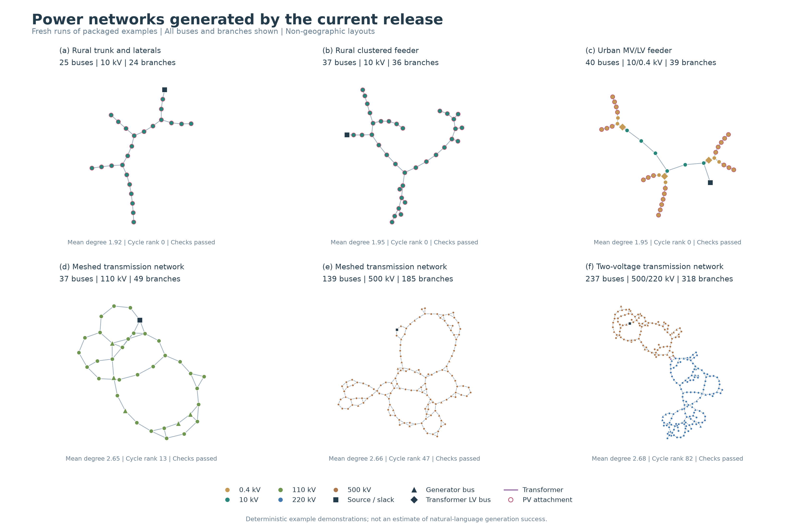
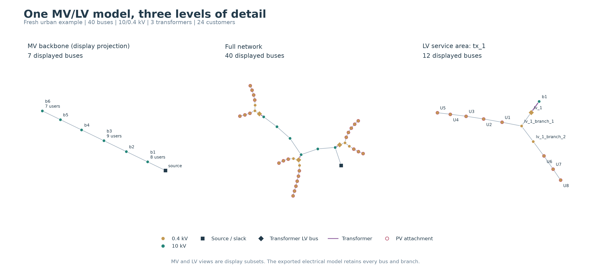

# GridGen-Agents

**Generate research power-system cases from natural-language requests or structured specifications.** Export callable OpenDSS and MATPOWER models with electrical validation records and interactive network diagrams.

[Repository](https://github.com/ZachariahZhou/GridGen-Agents) | [Architecture](docs/architecture.md) | [Usage](docs/usage.md) | [Verification](docs/verification.md)

This repository packages the **M87 research milestone**, with Python package version **0.1.0**. The Python package and CLI retain the name `feeder-agents`. Original code is licensed under [Apache-2.0](LICENSE); reference data and dependencies retain their own terms, documented in [THIRD_PARTY.md](THIRD_PARTY.md).

## Capabilities

- Urban and rural distribution feeders with balanced or phase-resolved unbalanced models, loads and equivalent PV injections.
- MV-transformer-LV-customer networks with overhead, buried, ducted and region-specific equipment choices.
- Single- and multi-voltage balanced AC transmission networks with generators, transformers and condition-dependent equipment selection.
- LangChain tools and LangGraph execution with requirement checks, electrical feedback, permitted repairs and rollback.
- Design-document rule extraction, project memory and repair experiences admitted after verification.
- Individual cases, batches, specified-condition target searches, a CLI and a Streamlit interface.

The delivered objects are research network models. Continuous annual time series, dynamic simulation, protection coordination, real GIS reconstruction and general-purpose OPF or N-1 design are outside the implemented scope. Acceptance refers to the checks actually executed for the selected specification.

## Installation

Use Python 3.11 or later. Local verification used Linux; some process locks require `fcntl`. Windows users can use WSL; native Windows execution has not been validated.

```bash
python -m venv .venv
source .venv/bin/activate
python -m pip install -e '.[dev,transmission,plots]'
feeder-agents --help
```

The core distribution CLI can be installed with `pip install -e .`. Optional extras add PYPOWER/SciPy (`transmission`), Matplotlib (`plots`) and pytest (`dev`). [requirements-tested.txt](requirements-tested.txt) records tested direct dependency versions, rather than a complete cross-platform lock.

## Try it without an API key

The packaged specifications run local generators and electrical solvers without external LLM calls:

```bash
feeder-agents generate --spec examples/distribution_radial.yaml --id radial_demo
feeder-agents generate --spec examples/distribution_villages.yaml --id villages_demo
feeder-agents hierarchy --spec examples/hierarchical_urban.yaml --id urban_demo
feeder-agents transmission --spec examples/transmission_37.yaml --id transmission_demo
```

| Specification | Model | CLI command |
|---|---|---|
| [distribution_radial.yaml](examples/distribution_radial.yaml) | 25 buses, 10 kV, rural trunk and laterals | `generate` |
| [distribution_villages.yaml](examples/distribution_villages.yaml) | 37 buses, 10 kV, three villages, unbalanced phases | `generate` |
| [hierarchical_urban.yaml](examples/hierarchical_urban.yaml) | Urban 10/0.4 kV, three transformers, 24 customers | `hierarchy` |
| [hierarchical_rural.yaml](examples/hierarchical_rural.yaml) | Rural 10/0.38 kV, three transformers, 24 customers | `hierarchy` |
| [transmission_37.yaml](examples/transmission_37.yaml) | 37 buses, 110 kV | `transmission` |
| [transmission_139.yaml](examples/transmission_139.yaml) | 139 buses, 500 kV | `transmission` |
| [transmission_237.yaml](examples/transmission_237.yaml) | 237 buses, 500/220 kV | `transmission` |

Outputs are saved under `workspace/`. An existing run ID resumes an identical configuration; use a new ID when changing parameters. Runtime outputs are excluded from Git.

## Natural-language design and web interface

```bash
cp .env.example .env
# Set your API key, service URL and an available model name in .env.
feeder-agents design 'Generate a rural 10 kV feeder with exactly 37 buses, three villages and 480 kW total demand. Use research defaults for unspecified settings.' --id language_demo
python -m streamlit run app.py
```

Open `http://localhost:8501`. Start the application from this directory so it reads the intended `.env`. Environment variables take precedence; the next model call reloads the file. The template uses `qwen3.7-plus` as an example identifier; availability depends on your provider account.

Natural-language planning and explicitly enabled agent feedback call the configured external model. Structured example commands use local execution by default. See [usage and outputs](docs/usage.md) for details.

## Figures from the current release



These networks are generated from the specifications shipped in this repository. The top row shows rural and urban distribution examples; the bottom row shows transmission networks with 37, 139 and 237 buses. Every bus and branch is retained. Coordinates are graph layouts, not geographic observations.



The second figure shows three views of the same newly generated urban MV/LV case. Display projections do not reduce the exported electrical model. These fixed examples demonstrate the generator and solvers; they do not estimate natural-language success rates.

Regenerate all seven examples and both figures:

```bash
python scripts/build_gallery.py
```

Each invocation creates a fresh run under `workspace/gallery/`. The [gallery manifest](docs/assets/gallery_manifest.json) records runtime, specification, model, validation and figure hashes. [Graph metrics](docs/assets/gallery_metrics.csv) support numerical inspection. Vector copies are available as [overview PDF](docs/assets/network_overview.pdf) and [hierarchy PDF](docs/assets/hierarchy_detail.pdf).

## Verification

```bash
python scripts/release_smoke.py --transmission
python scripts/check_examples.py
python -m pytest -q
```

Tests use controlled substitutes for external model decisions and actual OpenDSS/PYPOWER execution. They require no API key. Validation records and limitations are documented in [verification.md](docs/verification.md). Remote CI status is available in [GitHub Actions](https://github.com/ZachariahZhou/GridGen-Agents/actions/workflows/package-check.yml).

## Repository contents

```text
src/feeder_agents/   Runtime, rules and equipment catalogs
app.py              Streamlit interface
examples/           Seven executable input specifications
scripts/            Solver checks, example checks and gallery regeneration
tests/              Selected regression tests
docs/               Architecture, usage, verification and current figures
third_party/        Retained upstream license notices
SNAPSHOT.json       File hashes and provenance
```

See [snapshot scope](docs/snapshot-scope.md) for the selection policy. Historical experiment batches, private memory, raw downloads and paper drafts are excluded. Original-language source evidence and bilingual input-recognition fixtures are retained internally for traceability and language support.
