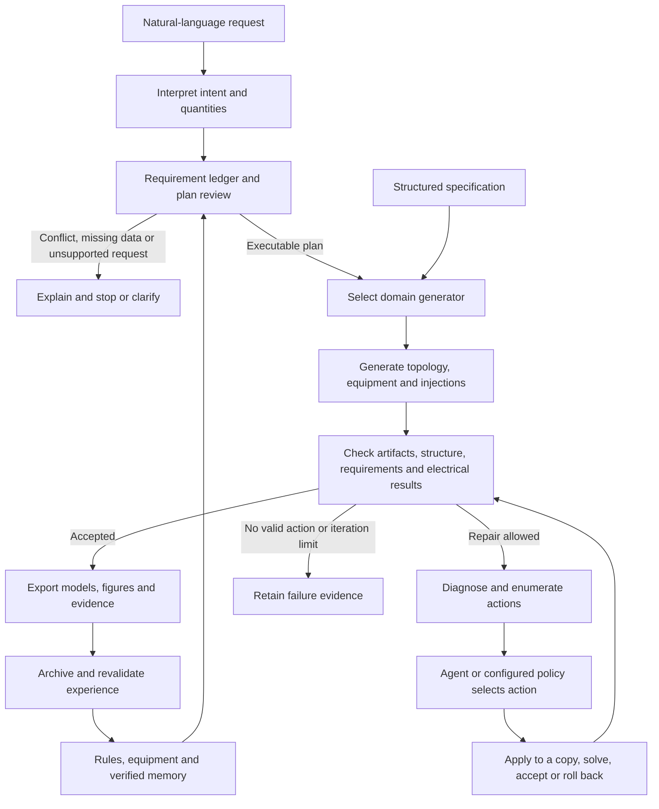
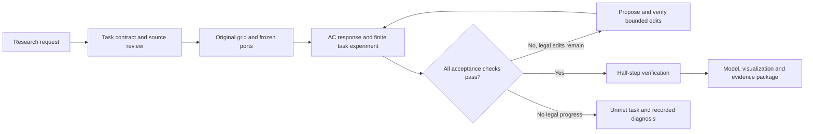

# Runtime architecture

GridGen-Agents synthesizes research cases against explicit user requirements. Reference cases, equipment catalogs and design documents inform parameters and rules. Deterministic checks and electrical solvers evaluate the resulting models.

Loops have iteration limits and termination conditions. Failure to find a solution is not a proof of mathematical infeasibility. Structured entry points bypass language interpretation; the command and specification determine whether agent feedback is enabled.

## Responsibilities

| Module | Responsibility |
|---|---|
| `agent.py` | LangChain tools, model configuration, conversations and SQLite checkpoints |
| `design.py`, `adaptive_planning.py` | Natural-language design, adaptive plan review and correction |
| `source_intent.py`, `source_bindings.py`, `requirement_*` | Source evidence, exact counts, conflicts and requirement acceptance |
| `schemas.py`, `generation.py`, `workflow.py` | Single-voltage distribution specifications and execution |
| `hierarchy.py`, `hierarchy_workflow.py` | MV-transformer-LV-customer generation and verification |
| `transmission.py`, `transmission_topology.py`, `transmission_equipment.py` | Transmission specifications, meshed connectivity and conditional equipment tuples |
| `simulation.py`, `evaluation.py` | OpenDSS execution and distribution measurements |
| `matpower.py`, `distribution_matpower.py` | MATPOWER parsing and eligible distribution exports |
| `repairs.py`, `hierarchy_feedback.py`, `transmission_feedback.py` | Permitted actions, feedback, re-evaluation and rollback |
| `memory.py`, `verified_memory.py`, `planning_memory.py`, `transmission_memory.py` | Project facts and verified planning/repair experience |
| `knowledge.py`, `rules.py`, `data/` | Document extraction, provenance, rules and catalogs |
| `schematic.py`, `visual_theme.py`, `ui_saved_records.py` | Network views and verified reading of saved results |

These are software responsibilities, not a count of independently invoked LLM agents. LLMs interpret requests, plan and select actions. Domain generators construct models; OpenDSS/PYPOWER perform physical calculations.

## Constraints and memory

Explicit total bus counts are preserved during generation and permitted repairs. Customer counts, load-point counts and total bus counts are separate quantities. Inferred defaults are distinguished from source-grounded requirements.

Memory does not create new hard design standards. Retrieval checks task scope, version, evidence and action permissions; previous experience cannot override the current request. The release includes no private conversations or learned user records. Each workspace accumulates its own memory.

## Model scope

Distribution uses a single equivalent source and equivalent grounding without an explicit neutral. PV is a static injection. Transmission uses balanced AC models with conditionally selected parameters. Parameter plausibility and acceptance under specified conditions do not imply reconstruction of a particular real network. Specified load/PV multipliers are discrete internal checks, not continuous time-series generation.

General-purpose OPF, N-1 design, protection coordination, dynamics and construction approval are outside the complete capability set. Standard exports support downstream analysis in external tools.

## Presentation and reproducibility

Public documentation, examples, default interface controls and diagram labels use English. English and Chinese parsing remain supported: Chinese recognition patterns and input fixtures are stored as Unicode-escaped literals without changing their decoded values. Original-language research documents remain in the parent research workspace; the release contains English translations with the original experimental scope and caveats. `scripts/build_gallery.py` generates and checks packaged examples before plotting them and records hashes of the actual artifacts. Layout changes affect display coordinates only.

## Electrical response extension

### Research-task orchestration

`research_language` compiles three research purposes with strict schema and source checks. Schema failures and source mismatches receive bounded, recorded correction calls. Exact counts, one-sided bounds, intervention units and explicit edit restrictions are checked before execution. `research_schema` validates the task/domain contract; `research_tasks` selects existing ports, freezes the original-model hash and compiles the response plan. Automatic PV ports must contain actual PV; transfer ports are non-reference buses.

`research_measurement` applies finite Q support, full PV-off/on or balanced fixed-Q MW transfer to copies of each candidate. These checks are acceptance gates within `response_design`, including final verification. The delivered static reference model keeps its specified demand and PV. `suitability.json` separates reference electrical feasibility, response attainment and finite task acceptance. Locked run identities and artifact hashes support safe history display and reproducible exports. [Detailed task method and evidence](research-task-workflows.md).

### Response search and measurements

`response_language` compiles an explicit response plan; `response_schema` validates target intervals and permissions. `response_measurement` freezes injection and observation ports and runs central finite-difference AC probes. `response_design` evaluates catalogue/circuit candidates, preserves protected fields and individual target deficits, optionally asks the LLM to choose a verified action, then runs an independent half-step check. `response_transmission` uses a DC rank-one update only for candidate ranking; AC checks determine acceptance. Raw probes, rejected candidates and selected model exports remain available for audit.

`response_distribution` adds coordinated path conductor replacements and catalogue-headroom evidence. Its optional `scale_layout` action uniformly scales generated distribution coordinates and lengths about the source, within an explicitly supplied bound relative to the original model. Exact coordinates forbid scaling. The language compiler checks numerical permissions and negations in the user input; unmet tasks include `diagnosis.json`, and catalogue proxy exhaustion never certifies physical infeasibility.

`response_flexibility` proposes bounded local subtree scaling, radial cross-cut reconnection and conserved demand relocation for eligible `spatial_mst` feeders. `response_contract` checks actual changes against the original model, including displacement, line geometry, changed edges, degree and half-L1 load movement. Permission sets determine which fields may change; exact bus counts, total P/Q, each PV injection, phase allocations within each load and source/control settings remain protected. `response_compensation` proposes counter-moves for satisfied targets only inside joint previews. Compound actions contain at most two basic moves, and their joint AC result must improve total deficit without worsening any individual deficit. Proposal screening and actual applied budgets are included in the auditable artifacts. See the [v3 experiment and design-space record](response-design-space.md).
