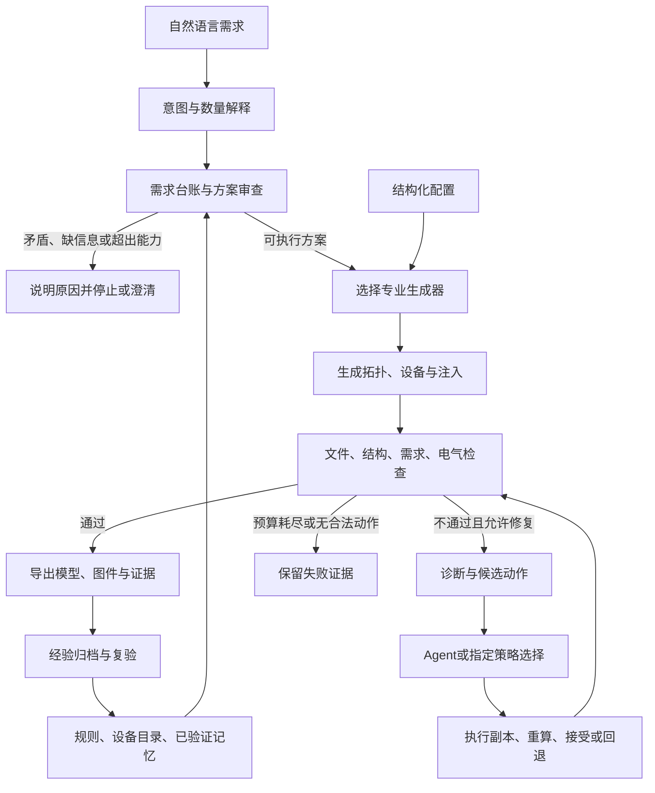

# M87 运行时架构

目标是按研究者给定的要求合成电网案例。真实案例、设备目录和设计文档提供参数与规则依据，生成结果由程序和电气求解器核验。

循环有预算和退出条件；“没有找到解”不等于证明数学不可行。结构化入口不经过语言解释，反馈的启用方式由命令和规格决定。

## 模块职责

| 模块 | 职责 |
|---|---|
| `agent.py` | LangChain 工具、对话与模型配置；SQLite 会话保存 |
| `design.py`、`adaptive_planning.py` | 自然语言入口、按任务需要审查和修正方案 |
| `source_intent.py`、`source_bindings.py`、`requirement_*` | 原文依据、精确数量、约束冲突及需求验收 |
| `schemas.py`、`generation.py`、`workflow.py` | 单电压配电规格、生成与执行 |
| `hierarchy.py`、`hierarchy_workflow.py` | 中压—配变—低压—用户生成和验证 |
| `transmission.py`、`transmission_topology.py`、`transmission_equipment.py` | 输电规格、网状连接、按条件选择设备成套参数 |
| `simulation.py`、`evaluation.py` | OpenDSS 调用与配电量测检查 |
| `matpower.py`、`distribution_matpower.py` | MATPOWER 文件解析及适用配电模型的格式转换 |
| `repairs.py`、`hierarchy_feedback.py`、`transmission_feedback.py` | 合法动作、反馈循环、复算及回退 |
| `memory.py`、`verified_memory.py`、`planning_memory.py`、`transmission_memory.py` | 项目事实、规划经验与经过复验的修复记录 |
| `knowledge.py`、`rules.py`、`data/` | 文档条款提取、来源、规则与设备目录 |
| `schematic.py`、`visual_theme.py`、`ui_saved_records.py` | 拓扑显示、页面样式和已保存结果的验证读取 |

这些是按职责划分的模块，不表示每个模块都是独立调用 LLM 的 Agent。LLM 负责解释、规划、诊断和动作选择；确定性生成器及 OpenDSS/PYPOWER 承担模型构造与物理计算。

## 约束与记忆

明确指定的总母线数在生成和修复中保持；用户数、负荷点数和总母线数分别建模。内部默认值和推断需要与原文条件区分。

记忆不是新的硬性设计规范。复用时检查任务、版本、证据及动作许可，不允许用历史经验覆盖当前用户需求。发布快照不预装用户记忆、历史对话或学习到的私有记录；这些由用户运行时在自己的工作区创建。

## 科研使用范围

配电采用单源及等效接地回路，不含显式中性线。PV 是静态注入配置。输电采用平衡交流模型；参数合理性与指定条件下验收是交付依据，不声明与某条真实线路逐项一致。多个指定负荷/PV倍率可作为内部验证条件，不生成连续时序。

通用 OPF、N−1 设计、保护配合、动态稳定与实网建设审批不属于本工具的完整能力。保留导出的标准格式便于用户在外部工具中继续分析。
