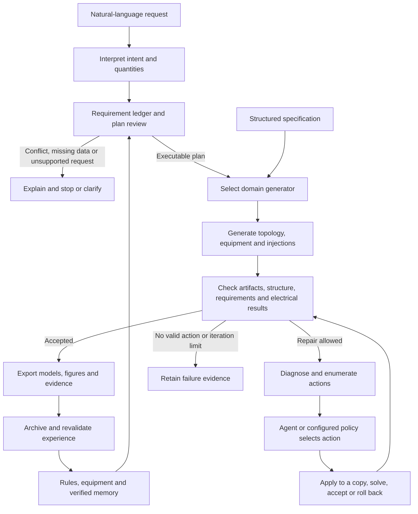

# Runtime architecture

GridGen-Agents synthesizes research cases against explicit user requirements. Reference cases, equipment catalogs and design documents inform parameters and rules. Deterministic checks and electrical solvers evaluate the resulting models.

Loops have iteration limits and termination conditions. Failure to find a solution is not a proof of mathematical infeasibility. Structured entry points bypass language interpretation; the command and specification determine whether agent feedback is enabled.

## Responsibilities

| Module | Responsibility |
|---|---|
| `agent.py` | LangChain tools, model configuration, conversations and SQLite checkpoints |
| `design.py`, `adaptive_planning.py` | Natural-language design, adaptive plan review and correction |
| `source_intent.py`, `source_bindings.py`, `requirement_*` | Source evidence, exact counts, conflicts and requirement acceptance |
| `schemas.py`, `generation.py`, `workflow.py` | Single-voltage distribution specifications and execution |
| `hierarchy.py`, `hierarchy_workflow.py` | MV-transformer-LV-customer generation and verification |
| `transmission.py`, `transmission_topology.py`, `transmission_equipment.py` | Transmission specifications, meshed connectivity and conditional equipment tuples |
| `simulation.py`, `evaluation.py` | OpenDSS execution and distribution measurements |
| `matpower.py`, `distribution_matpower.py` | MATPOWER parsing and eligible distribution exports |
| `repairs.py`, `hierarchy_feedback.py`, `transmission_feedback.py` | Permitted actions, feedback, re-evaluation and rollback |
| `memory.py`, `verified_memory.py`, `planning_memory.py`, `transmission_memory.py` | Project facts and verified planning/repair experience |
| `knowledge.py`, `rules.py`, `data/` | Document extraction, provenance, rules and catalogs |
| `schematic.py`, `visual_theme.py`, `ui_saved_records.py` | Network views and verified reading of saved results |

These are software responsibilities, not a count of independently invoked LLM agents. LLMs interpret requests, plan and select actions. Domain generators construct models; OpenDSS/PYPOWER perform physical calculations.

## Constraints and memory

Explicit total bus counts are preserved during generation and permitted repairs. Customer counts, load-point counts and total bus counts are separate quantities. Inferred defaults are distinguished from source-grounded requirements.

Memory does not create new hard design standards. Retrieval checks task scope, version, evidence and action permissions; previous experience cannot override the current request. The release includes no private conversations or learned user records. Each workspace accumulates its own memory.

## Model scope

Distribution uses a single equivalent source and equivalent grounding without an explicit neutral. PV is a static injection. Transmission uses balanced AC models with conditionally selected parameters. Parameter plausibility and acceptance under specified conditions do not imply reconstruction of a particular real network. Specified load/PV multipliers are discrete internal checks, not continuous time-series generation.

General-purpose OPF, N-1 design, protection coordination, dynamics and construction approval are outside the complete capability set. Standard exports support downstream analysis in external tools.

## Presentation and reproducibility

Public documentation, default interface controls and diagram labels use English. Original-language evidence and bilingual parsing remain part of the implementation. `scripts/build_gallery.py` generates and checks packaged examples before plotting them and records hashes of the actual artifacts. Layout changes affect display coordinates only.
