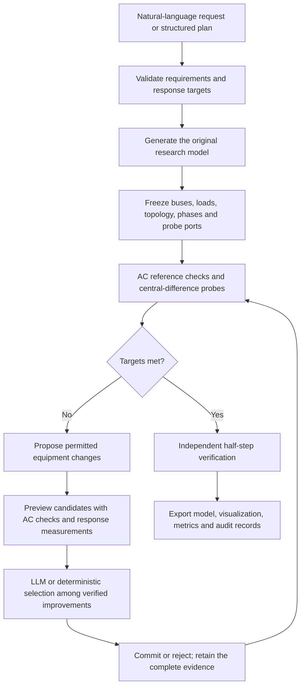

# M88: Research grid generation with controlled electrical response

> The current milestone is **M88-response-v3** (2026-10-09), which adds bounded local geometry changes, branch reconnection, load redistribution and joint candidates. See the [design-space extension](response-design-space.md) for the complete method, boundaries and 18 paired experiments. The original workflow below keeps geometry, topology and loads fixed by default; expanded permissions must be specified separately.

## 1. Added capabilities

The independent `electrical_response` design workflow builds on the existing generators, equipment catalogs, OpenDSS/PYPOWER solvers and LangChain tools. It produces directly usable research network models and measures specified electrical responses through static perturbations.

The first version supports:

| Domain | Response target | Delivered model | Permitted changes |
|---|---|---|---|
| Single-voltage balanced or three-phase unbalanced distribution feeders | Sensitivity of specified bus-phase voltages to active or reactive power injection | OpenDSS | Complete catalog conductor replacements compatible with phase count, construction type and source scope |
| Balanced AC transmission networks | Branch active-power response to a transfer between two specified bus groups | MATPOWER | Complete parallel circuits, preserving the original charging-compensation ratio |

Existing multi-voltage hierarchy generation remains available, but response inverse design for that domain is not implemented in this version. The workflow does not prove the realizability of arbitrary response matrices, model dynamic responses, certify N-1 security or generate annual time series. Requests for "high/medium/low sensitivity" without a reference require clarification; uncalibrated categories are not treated as engineering standards.

## 2. Workflow



Search also stops at its round limit or when no verified improvement remains. It delivers the best retained candidate and an explanation of unmet targets; this does not establish mathematical infeasibility. The original reference model, all candidates and rejection records are retained. Failed samples are not replaced.

## 3. Electrical response and physical boundaries

For injection direction u and step h, the central difference is:

    S ≈ [y(p + h*u) - y(p - h*u)] / (2*h)

For distribution, y is bus-phase voltage magnitude, with sensitivity measured in pu/MW or pu/MVAr. The step h is the total perturbation across the injection group, divided equally among the selected bus-phase ports; the entire h must not be applied independently to every phase. The complete signed response vector is saved, then reduced with `mean_abs` or `max_abs` for target evaluation. An unspecified port defaults to the load bus farthest from the source by path length and is frozen before search. Topology and coordinates are not optimization variables in this initial version.

For transmission, y is the active power at the sending end of a branch with a fixed orientation, measured in MW/MW. Two disjoint bus groups receive equal injection and withdrawal; the reference generator supplies incremental AC losses. A regional transfer measures one response column for a specified direction, rather than computing or matching an entire PTDF matrix.

Distribution uses the existing source equivalent with 1000/500 MVA three-phase/single-phase short-circuit capacities and disabled controllers. Transmission keeps PV-bus voltage setpoints and bus types fixed, and checks generator P/Q limits at the reference operating point. Voltage sensitivity must not be interpreted as dynamic stability, short-circuit ratio or transient voltage strength.

After candidate selection, independent verification repeats the measurement at h/2, checking both targets and componentwise response agreement. This verification does not participate in search. It checks the numerical stability of local finite differences; it does not establish generalization to other injection locations, controller states or large perturbations.

## 4. Preserving research objectives and selecting candidates

Each target specifies an absolute interval or a multiplier interval relative to the original reference response. The denominator is frozen before search and is never updated between iterations. Deficits are recorded separately for each target; improvement in one target cannot offset deterioration in another.

A candidate can be committed only if:

1. All existing reference electrical and engineering checks pass.
2. Protected fields, including buses, topology, coordinates, loads, PV and phases, are preserved.
3. No response-target deficit increases, and at least one strictly improves, or the reference electrical state changes from unacceptable to acceptable.
4. Every modification falls within the explicitly authorized action scope.

Distribution conductor replacements use complete catalog combinations of impedance matrices, capacitance matrices and ampacity. R, X and ratings are not perturbed independently. Transmission parallel circuits follow the existing parameter transformation: equivalent impedance, capacitance and capacity change together, and associated fixed compensation is recomputed using the unchanged compensation ratio. This is a recorded equipment-combination change, rather than an independently optimized reactive-compensation policy.

Transmission candidate ranking adds a DC response estimate based on the bus susceptance matrix. A parallel circuit produces a rank-one change in the reduced bus matrix; a Sherman–Morrison update estimates transfer flows, including alternative routes that previously carried little power. This estimate only ranks candidates. AC solutions and target checks determine acceptance; the estimate is not a new AC feasibility theorem.

With `selector=heuristic`, measured target deficits determine selection, and the record explicitly states that no LLM was called. With `selector=agent`, the configured model receives candidates that already satisfy the improvement criterion, target gaps and action rationales, then selects a candidate or stops. It cannot invent actions or override numerical acceptance. Model-call failures, invalid selections and stop requests are recorded without silently switching strategies.

## 5. Usage

Structured input requires no API:

```bash
feeder-agents response-design --plan examples/response_rural_37.yaml --id response_rural
feeder-agents response-design --plan examples/response_transmission_139.yaml --id response_tx
```

Natural-language execution uses the actual configuration in `.env`:

```bash
feeder-agents design 'Generate a rural three-phase unbalanced feeder with 10 kV, 37 buses, 480 kW and three villages. Increase active-power voltage sensitivity at the farthest load bus to 1.05–1.25 times its original baseline. Allow only catalog conductor replacement, preserving topology and loads. Use LLM agent feedback to select verified candidates.' --id response_language
```

The same request can be entered on the web interface's natural-language page. The result page shows target acceptance, independent verification, modification rounds and the selected model, and provides a model-package download. LangChain adds `describe_electrical_response_capabilities` and `design_electrical_response`.

Outputs are saved under `response_designs/<id>/`, including `manifest.json`, `resolved_probes.json`, `baseline/`, `trials/`, `history.json`, `candidates.csv`, `verification/`, `selected/`, `dataset.zip` and `result.json`. Source-code, plan, result and file digests prevent mixing configurations or accepting damaged artifacts. The original natural-language request, draft and model-call records are saved under `designs/<id>/`.

## 6. Experiments and research claims

The pilot includes urban 25-bus and rural 37-bus three-phase unbalanced feeders, plus 37- and 139-bus transmission models. Each group uses three seeds. Distribution targets include increased and decreased sensitivity; transmission targets reduce maximum branch response. Every task retains its original reference model, every attempt appears in the CSV, and failures are not replaced by new samples.

Of the initial 18 tasks, all 18 selected models passed reference electrical checks and all 18 protected contracts were preserved; 12 met their response targets and passed half-step verification. Some failures motivated candidate-search improvements. Retests ran only the initially unsuccessful tasks and were recorded separately; cumulative results cannot be presented as a complete independent comparison after the fixes.

A separate end-to-end natural-language check used the actual `.env` model, `qwen3.7-plus`. Initial compilation produced unnormalized phase weights and a conflict between default load-point counts and an exact bus count. Compiler constraints, correction context containing the original output, and an explicit `planning_failed` status were then added. The retest compiled successfully, preserved the 37-bus requirement, and used two LLM selection rounds to meet the targets and pass independent verification. One success cannot estimate overall natural-language accuracy.

The evidence supports claims of explicit response targets, constrained equipment inverse design and verified feedback that preserves research requirements. It does not support universal realizability of research tasks, a complete physical-realizability decision procedure or an overall 100% success rate. Future work may address coupled targets across ports, justified topology changes and conditions for response-target realizability.
