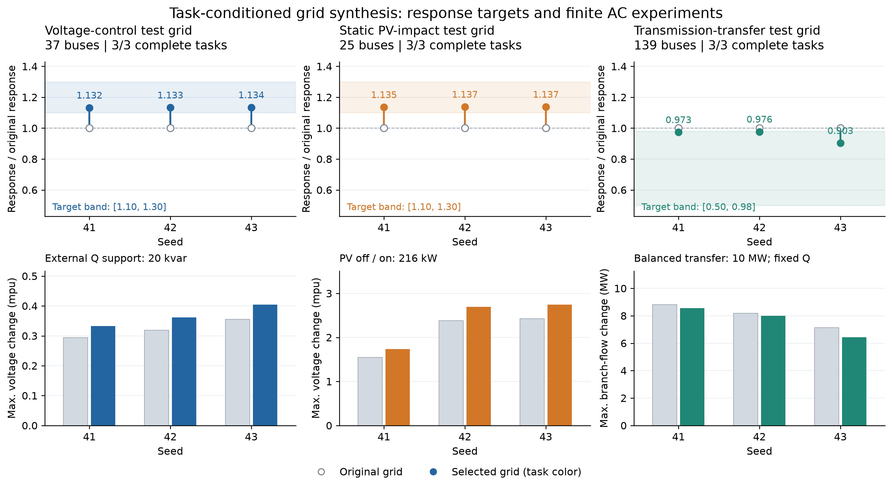

# M89: Complete grid-generation workflows for three research tasks

Date: 2026-10-09. Development milestone: **M89-task-v1**. The package version remains **0.1.0**.

This implementation connects voltage control, static PV integration impact and transmission power transfer through one executable workflow: **natural-language request → task contract → original grid and fixed test ports → response measurement → bounded design loop → finite-perturbation acceptance → model and evidence export**. The standard generation entry point, dedicated CLI, LangChain tools and web result reader all support it.

The deliverable is a static grid model suitable for the specified research experiment. Temporary perturbations support measurement and verification and are saved as evidence. The delivered `selected` model preserves the specified reference demand and PV. The task workflow does not add 8760-hour data generation.

## 1. What each task does

| Task | Design target | Acceptance experiment actually executed | Main deliverables |
|---|---|---|---|
| Voltage control, `voltage_control` | Reactive-power voltage-magnitude sensitivity d\|V\|/dQ at specified ports | Apply the specified MVAr of external reactive support to a model copy; check actual injection, voltages, line currents, imbalance and power balance | OpenDSS, voltage responses, reusable test ports and reactive-power budget |
| Static PV impact, `static_pv_impact` | Active-power voltage-magnitude sensitivity d\|V\|/dP at actual PV buses | Turn all existing PV off/on under the same topology, equipment and total demand; record changes in voltages, source power and network losses | OpenDSS with the originally specified PV, plus PV-off/on evidence |
| Transmission power transfer, `transmission_transfer` | Maximum monitored branch active-power response, MW/MW, at fixed transfer ports | Execute equal injection/withdrawal of the specified MW while holding reactive demand fixed; check AC power flow, voltages, branch ratings and generator P/Q limits | MATPOWER, transfer ports, branch responses and remaining-capacity fractions |

The voltage task verifies network response to an external test actuator; it does not automatically install a controller or establish the superiority of a control algorithm. The PV task currently controls local d\|V\|/dP, while full PV-off/on is an additional finite-perturbation acceptance check. It must not be described as inverse design for arbitrary PV voltage changes or a solution for maximum hosting capacity. The transmission task uses a fixed transfer amount and does not compute maximum transfer capacity, economic dispatch or an N−1 certificate.

## 2. From request to a verifiable task contract

`ResearchTaskPlan` records the research question, grid specification, response bounds, test ports, phases, perturbation step, finite reactive-support/transfer budget, and permitted equipment, geometry and topology changes.

- Explicit bus counts must be preserved exactly. When omitted, a recorded default may be used. The live voltage request in this study omitted the count and generated the default 37 buses.
- Numerical source checks cover bus count, voltage, total demand, PV fraction, MVAr/MW perturbation budgets, response intervals and principal modification permissions. Values expressed in kvar or kW are converted appropriately.
- "At least," "at most" and bounds split across clauses retain their mathematical meanings. A lower bound must not become an exact equality, and a conflicting upper bound must not be overwritten to continue generation.
- Terms such as "high sensitivity" require clarification unless accompanied by a number or calibrated reference. If response values are unspecified, the compiler may use explicitly disclosed research-protocol defaults.
- LLM outputs must satisfy a strict schema. If values conflict with the original request, the LLM receives specific check results and one opportunity to correct source mismatches; a second mismatch stops execution. Structural formatting errors receive a separate correction opportunity. Calls and errors are archived.

The default response protocol requires final/original response ratios of **1.10–1.30** for voltage and PV tasks and **0.50–0.98** for transmission. These values demonstrate generation of research cases with distinguishable electrical responses. They are not industry standards or difficulty classes calibrated from many real systems. A stronger reactive-power voltage response does not automatically imply better voltage quality or controller performance.

Fresh distribution synthesis permits compatible conductor replacements and uniform scaling by up to 75% relative to the original geometry by default. Explicitly fixed coordinates remove scaling. Transmission defaults use parallel-line actions allowed by the specification. Users may supply tighter `search` permissions. Local scaling, reconnection and load redistribution retain the response-design API's explicit numerical permissions. Defaults are at most four rounds and 12 candidate previews per round. `origins` records whether fields came from the explicit plan or protocol defaults. The original natural-language request and numerical checks are saved separately in the brief and call records; `origins=user` alone does not establish that every word of a request has been verified.

## 3. Selecting ports and freezing the original reference

The compiler first generates the original model with a fixed seed, then determines ports:

1. Voltage tasks default to the load bus farthest from the source by path length.
2. PV tasks select only load buses with actual PV, defaulting to the farthest such bus.
3. Transmission tasks default to the two non-reference buses with the greatest graph distance, forming injection and withdrawal groups.

Legal ports explicitly supplied by the user take precedence. The original model hash, ports, observations, perturbation budget, targets and response denominator are frozen before search. This prevents apparent target attainment through moving measurement locations or changing the comparison reference. A task ID cannot be reused with a different configuration or code version. Integrity-checked readers detect changes to result files.

## 4. Physical measurement and acceptance in the loop

Let G denote the grid, u the total port perturbation and y the observation. The central-difference measurement is:

\[
S_h(G)=\frac{y(G,+h)-y(G,-h)}{2h}.
\]

Voltage tasks use the mean absolute response across monitored bus-phase ports; transmission tasks use the maximum absolute active-power response across monitored branches. Relative targets use the original model G₀'s fixed response as the denominator.

Every candidate undergoes four classes of checks:

1. **Original requirements and modification bounds:** exact bus counts, specified demand and PV, phases, nominal voltage and source-control settings must remain protected.
2. **Reference electrical feasibility:** existing OpenDSS or PYPOWER acceptance applies.
3. **Response targets:** candidates must improve unmet targets and obey the protection conditions for existing targets.
4. **Finite task experiments:** the specified reactive support, complete PV switching or MW transfer must be executable and pass its electrical checks.

A failed finite perturbation blocks candidate acceptance. Meeting a local derivative target cannot produce a successful result with only a warning about the failed experiment. When no legal improvement remains, the run records `task_not_satisfied` and a diagnosis. Budgets are not automatically reduced and targets are not automatically relaxed. A failed finite search does not prove that the requested grid is physically impossible.

Finally, the response is independently remeasured at h/2, numerical consistency is checked, and the task experiment is repeated. Candidate selection can be deterministic or use `search.selector: agent` for the configured LLM to choose among verified candidates. The nine fixed-plan experiments and completed records for the three natural-language task types in this study used deterministic candidate selection. The LLM compiled requirements; these results cannot be attributed to LLM search outperforming other algorithms.

## 5. Experiment question, procedure and complete results

The experimental question is: **Can all three task types produce grid models with reproducible evidence from fixed specifications through actual physical measurements, legal modifications and finite-task acceptance?**

Three example plans and seeds 41, 42 and 43 were fixed in advance, yielding nine cases without replacement of failed seeds. Voltage tasks used 37 buses, 10 kV, a rural scenario, 360 kW and 20 kvar support. PV tasks used 25 buses, 10 kV, an urban scenario, 360 kW demand and 216 kW PV. Both distribution groups used three-phase unbalanced loads, with single-phase and two-phase branch fractions both zero. Transmission tasks used 139 buses, 220 kV, 12 generators, 1200 MW total demand and a 10 MW transfer. Response intervals followed the protocol above.

| Task | Seed | Buses | Final/original response | Finite-experiment effect: original → final | Accepted changes |
|---|---:|---:|---:|---:|---:|
| Voltage control | 41 | 37 | 1.131972 | 0.00029440 → 0.00033303 pu | 1 |
| Voltage control | 42 | 37 | 1.132679 | 0.00031876 → 0.00036142 pu | 1 |
| Voltage control | 43 | 37 | 1.133879 | 0.00035570 → 0.00040389 pu | 1 |
| Static PV | 41 | 25 | 1.135330 | 0.00154260 → 0.00173316 pu | 1 |
| Static PV | 42 | 25 | 1.137482 | 0.00238229 → 0.00269153 pu | 1 |
| Static PV | 43 | 25 | 1.137259 | 0.00242610 → 0.00274154 pu | 1 |
| Transmission transfer | 41 | 139 | 0.973153 | 8.80179529 → 8.56550780 MW | 1 |
| Transmission transfer | 42 | 139 | 0.976488 | 8.18116030 → 7.98861397 MW | 1 |
| Transmission transfer | 43 | 139 | 0.902680 | 7.12662055 → 6.43305331 MW | 1 |

The distribution finite-experiment effect is the maximum voltage-magnitude change at selected monitoring ports; the transmission effect is the maximum monitored branch active-power change. These quantities are recorded separately from the local response targets. All 9/9 passed reference electrical checks, protected constraints, finite-task experiments and final half-step verification. The six distribution cases accepted uniform scale factors of 1.14; the three transmission cases accepted legal parallel-line changes. A 75% allowance does not mean a 75% change was applied. These controlled examples verify the end-to-end workflow; they are not a statistical estimate of success on arbitrary natural-language tasks.



[PDF](assets/research_tasks.pdf) · [Complete results CSV](assets/research_tasks_results.csv) · [JSON with all finite-experiment metrics](assets/research_tasks_results.json) · [Fixed input plans](assets/research_tasks_suite.json) · [Hashes, accepted actions and verification records](assets/research_tasks_provenance.json)

### Live model calls and retained failures

The model called through the actual `.env` configuration was **qwen3.7-plus**, rather than the earlier model name mentioned in historical conversation. Complete records remain for three distinct natural-language requests. Only the failed voltage request was retested:

| Record | Outcome | Cause / response ratio | LLM calls |
|---|---|---|---:|
| Initial voltage task | needs_clarification | The LLM represented the default response interval as an explicit target without supporting numbers in the request | 1 |
| Initial PV task | completed | 25 buses, ratio 1.137482 | 1 |
| Initial transmission task | completed | 139 buses, ratio 0.976488; includes one formatting correction | 2 |
| First voltage retest | planning_failed | The LLM incorrectly nested `phase_design` and other fields inside `scenario`; errors remained after formatting correction | 2 |
| Voltage retest after fixes | completed | 37 buses, ratio 1.132679 | 1 |

These observed problems motivated source-mismatch feedback with one automatic correction, explicit field paths, concise schema examples and clear instructions that the compiler supplies default search settings and targets. Failed records were not overwritten. All three requests eventually produced successful artifacts; this is **integration verification across fixes**, not "100% first-attempt natural-language success on one version." See [all attempt summaries and original requests](assets/research_tasks_live.json).

### Regression and review

The complete release suite passed **237 tests in 102.33 seconds**. A subsequent change affected only field-path prompt wording; all **36 task tests passed in 4.78 seconds**, followed by the final live model call in the table. New tests use actual electrical solvers for finite perturbations, protected contracts, exports and hash corruption. Requirement-compilation tests use controlled model substitutes. Excessive forced reactive support must fail the task even when the response interval includes the reference value.

Independent review found and fixed default search permissions overriding explicit restrictions, unchecked load/perturbation budgets, negated-task routing and one-sided bounds incorrectly becoming equalities. Principal new cases first reproduced failures and then passed after fixes. The nine fixed-plan cases retain their execution-time code hashes; later language-source and prompt fixes do not affect physical execution of those structured plans. Historical large batches were not rerun, and M88 results were not rewritten.

## 6. Usage and deliverables

After installation in the release directory, run these structured commands without LLM calls:

```bash
feeder-agents --workspace workspace/tasks research-design --plan examples/research_voltage_control.yaml --id voltage
feeder-agents --workspace workspace/tasks research-design --plan examples/research_static_pv_impact.yaml --id pv
feeder-agents --workspace workspace/tasks research-design --plan examples/research_transmission_transfer.yaml --id transfer
```

The natural-language entry point reads `.env` from the launch directory. An exact bus count may be supplied or omitted:

```bash
feeder-agents --workspace workspace/tasks research-design \
  --request 'Generate a rural 10 kV feeder for voltage control, with 360 kW total load and 20 kvar reactive support. Use the disclosed default research protocol.' \
  --id voltage_language
```

`--draft` compiles the task without executing physical design. The standard `design` entry point and web interface also route these three types of research requests to this workflow. LangChain adds `describe_research_tasks` and `design_research_grid`.

Results are saved under `research_tasks/<id>/`:

| File / directory | Purpose |
|---|---|
| `compiled_plan.json`, `manifest.json` | Complete contract, ports, default origins and code identity |
| `selected/` | Directly usable grid files, HTML visualization and final model parameters |
| `suitability.json` | Separate records for original/final reference feasibility, response targets and finite-experiment acceptance |
| `response_designs/response/` | Original model, all candidates, acceptance history, actual perturbations and half-step verification |
| `report.md`, `result.json` | Human-readable report and hash-verified machine-readable result |
| `dataset.zip` | Model and experimental-evidence package |

The natural-language brief and individual model calls are saved separately under `designs/<id>/`. The web interface verifies artifact hashes when reading existing results; it does not trust a cached success flag alone.

Reproduce experiments and figures:

```bash
python scripts/run_research_tasks.py --output workspace/research_task_reproduction
python scripts/plot_research_tasks.py --results workspace/research_task_reproduction/results.json --output docs/assets/research_tasks
```

A paper should use these results as method examples showing how research tasks become models and verifiable electrical experiments. Broader applicability requires independent variation of target strength, task budgets, load/PV scale and modification permissions, plus comparisons with methods that omit task feedback under otherwise identical conditions. These nine standard tasks alone do not establish universal optimality or a general 100% success rate.
