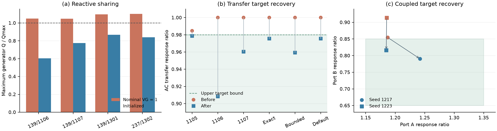

# M90 response reliability: method and case-study addendum

Date: 2026-10-10. Release snapshot: **M90-response-fix-v1**, based on M89 commit `dd103ab2e12c85433e50ff2610b2f2d37c3cc065`. Package version remains 0.1.0.

## What was repaired

All **eight previously unsuccessful task instances** covered by this follow-up now pass their original response targets, independent perturbation-step verification, and protected-model contract. The six transmission tasks also pass their finite-transfer checks. Twelve additional successful or unseen-seed controls pass. This is **20/20 targeted structured runs**, not a complete rerun of the M89 campaign and not a guarantee for arbitrary requests.

Fresh natural-language execution using the existing `.env` model, **qwen3.7-plus**, passes **6/6 valid requests**, including the three previously unsuccessful language requests, and correctly stops **2/2 boundary requests**. Field-level gold checks and physical acceptance are scored separately. Seven actual LLM calls serve these eight requests; the annual-product request stops locally before an LLM call. An additional one-request connectivity/workflow probe with the same model also passes and is retained separately.

The user-authorized **qwen3.8-flash** was attempted first. Seven requests returned provider HTTP 403 with `AllocationQuota.FreeTierOnly`; one annual-product boundary request stopped locally. These attempts are retained as provider failures and are not reported as successful model evaluations. The working `.env` was not changed and billing settings were not modified.

## Complete failure audit for the M89 campaign

The audit covers every unsuccessful record in the frozen M89 structured campaign and valid language requests. Five full-system structured failures and three valid-language failures are all resolved. The remaining historical records consist of seventeen uniform-selector comparison failures, fifteen restricted-design-space failures and nine deliberately increased finite-intervention stress failures. Their recorded outcomes are preserved. The earlier eight-round diagnostic for transfer seed 1105 is superseded by the verified original-budget fix. The external `qwen3.8-flash` free-quota rejection remains a provider condition; successful live verification used `qwen3.7-plus`.

See the complete [resolution ledger](m90-failure-resolution.csv) and [hashed repair mapping](m90-failure-resolution.json). Bounded-search failure under restricted permissions is not a proof of mathematical infeasibility.

## Failure mechanisms and targeted changes

### 1. Reactive sharing at the initial transmission operating point

The failing transmission samples had ample aggregate reactive capability but concentrated reactive output at one unit when every PV generator used `VG=1.0`. The four unique models produced 94.19--99.16 Mvar at an offending unit against its unchanged 90 Mvar upper limit. Response search allowed parallel circuits and froze voltage controls; consequently it could not resolve the initial operating-point defect.

Construction now performs a bounded, target-independent voltage initialization **before** task ports, model hashes and response references are frozen. It activates only for an isolated generator-Q violation when other base checks pass and `voltage_setpoint` is permitted. It offers local steps of 0.0001, 0.0005 and 0.001 p.u., bounds cumulative movement to 0.01 p.u. from nominal, and respects the requested voltage bounds and the existing 0.95--1.05 p.u. setpoint envelope. It uses at most six rounds and nineteen validation calls per construction. Requested validation conditions can entail additional solver work within each call.

Candidates must retain all other checks and introduce no new or larger physical Q violation. A five-percent interior margin of the declared Q range guides the operating-point search; it does not replace the original Q acceptance limits. Trials, initial/final Q outputs, setpoints, bounds and decisions are stored in hashed metadata. The observed corrections changed one setpoint to 0.999 or 0.9995 p.u., using three or four validation calls per construction.

An independent matrix comparison verifies identical bus and branch matrices, demand, active dispatch, generator placement and installed P/Q limits between each frozen model and its new pre-search reference. Only generator voltage settings change where necessary. This intentionally changes the initial operating point for Q-defective models. Their ratios refer to the newly initialized and then frozen reference; they are not retrospectively ratios against the old infeasible operating point. The compiler and runner both construct this deterministic reference, so initialization cost is additional to the response candidate budget.

### 2. Myopic corridor choice in transmission response search

Seed 1105 was electrically feasible but selected an immediately attractive corridor. Four rounds reached a response ratio of 0.984714, outside the original upper bound of 0.98. An earlier eight-round follow-up still ended at 0.981152. A diagnostic that merely offered larger circuit endpoints also failed within four rounds, so these remedies were not adopted.

The revised proposer uses a two-step DC lookahead over legal single-circuit additions. It evaluates how a first addition changes the value of a possible second addition, including redistribution onto competing paths. The second-step prediction is a rank-one update of the already updated reduced nodal model. Lookahead is disabled when only one response round remains. The four-circuit cap, one-circuit increment, topology and number of permitted simultaneous edits remain unchanged.

Selection first prefers any fully AC-verified candidate that completes the targets. Otherwise it considers the bounded prospective DC deficit among candidates that already passed the full AC and non-worsening gates, followed by their measured current deficit. A predicted second step is never committed automatically. It must be proposed and verified again at the next round. The exact frozen task now reaches 0.978658 within the original four-round, twelve-preview-per-round budget.

For a reduced incidence matrix A and branch susceptances b, the surrogate uses B = A^T diag(b) A. Adding a circuit to branch i changes B by delta_b_i a_i a_i^T. Sherman--Morrison updates provide one- and two-step predictions without replacing AC validation. Independent review compared all nine legal first moves and legal continuations in a six-bus, two-probe network against direct DC solves, agreeing within 1e-11.

### 3. Coupled distribution goals and preview coverage

The two opposing-port failures had already satisfied target A, but could not reduce target B sufficiently. The candidate inventory contained useful local edits. Ordering and truncation let broad shared-path moves consume the preview budget, and the first twelve elementary moves used to construct pairs could all come from one port.

A measured-response-calibrated radial-path impedance proxy now scores complete proposals against **every** target. It uses shared source-path R for active-injection voltage response and X for reactive-injection response, with explicit injection and monitoring ports and aggregation. Candidate family and target-port diversity is preserved before pair construction. The complete elementary and joint proposals are then ranked together. Authorized action families not covered by the proxy retain preview access through interleaving.

The proxy is a ranking heuristic, especially for unbalanced mutual coupling. Original-reference edit budgets, all AC checks, target-wise non-worsening and independent step verification remain authoritative. A new control exposed a one-port starvation regression during development; that failed attempt was retained, the diversity fix was added, and the control subsequently passed. Both original opposing-port failures now complete in one round with sixteen AC previews, using two permitted local subtree moves.

## Repaired task results



The figure uses the original response intervals. Each version uses its own pre-search frozen reference in panel (b); panel (a) makes the operating-point correction explicit.

Transmission ratios retain the target interval [0.50, 0.98]. Opposing distribution rows show (A, B), retaining A in [1.15, 1.35] and B in [0.65, 0.85]. A before-ratio of 1 for a Q-defective transmission case means no response edit could be accepted; it does not imply a feasible baseline.

| Frozen task | Before | After | Committed steps | AC previews |
|---|---:|---:|---:|---:|
| `r_transmission_transfer_139_1105_directed` | 0.984714 | 0.978658 | 2 | 24 |
| `r_transmission_transfer_139_1106_directed` | 1.000000 | 0.908346 | 1 | 12 |
| `r_transmission_transfer_139_1107_directed` | 1.000000 | 0.960390 | 2 | 24 |
| `nl_transfer_exact_1` | 1.000000 | 0.975551 | 1 | 12 |
| `nl_transfer_bounded_2` | 1.000000 | 0.959281 | 1 | 12 |
| `nl_transfer_omitted_size_1` | 1.000000 | 0.975551 | 1 | 12 |
| `c_opposed_1217_expanded` | 1.187343, 0.854430 | 1.242204, 0.790173 | 1 | 16 |
| `c_opposed_1223_expanded` | 1.185637, 0.913290 | 1.185015, 0.816210 | 1 | 16 |

The old and new task probes, response intervals and search permissions were compared directly. Distribution frozen-model hashes are identical for the paired old/new cases. For transmission, bus/branch matrices and all generator fields other than permitted voltage settings are identical. The maximum observed pre-search setpoint change is 0.001 p.u.

## Additional controls and natural-language checks

The twelve controls comprise three previously successful simple task cases, four new-seed simple task cases, three previously successful opposing-port cases and two new-seed opposing-port cases. They cover voltage support, static PV impact and transmission transfer, including 139- and 237-bus transmission systems. All pass. The seven final opposing-port tasks, including the two repairs and five controls, each use one response round and sixteen AC previews.

The live language subset contains the three previously unsuccessful transfer requests, a successful transfer control, an urban PV case, and a rural voltage-control case. It also includes contradictory response bounds and a mandatory annual time-series product. All six valid requests preserve their prewritten gold fields and pass physical validation; both boundary cases explain non-generation. This subset supports recovery of the reported failures, not unrestricted semantic understanding or universal success.

The deliberately extreme finite-intervention stress tests from M89 remain negative controls. Their interventions and acceptance gates were not weakened. They were not included in the repair denominator.

## Verification and reproducibility

- Current release regression suite: **253 passed**.
- New regressions in the normal development import path: **15 passed**.
- Result readers verified all twenty selected structured result hashes and nested response artifacts, plus the six successful live task artifacts.
- Frozen M89 data and archive remain available unchanged. Intermediate unsuccessful diagnostics and API attempts are retained separately.
- Development source and curated release share the four repaired implementation modules.
- No credentials, `.env`, Git metadata or caches belong in the follow-up archive.

The JSON/CSV results identify each original task, before/after response ratios, committed steps, previews, contract checks, result path, result hash and runtime fingerprint. Intermediate diagnostic runs retain their own source hashes. All twenty rows in the final structured table use the same final runtime fingerprint; only earlier-revision rows were replayed after the last ordering correction. The final code fingerprint is `63083dbf465d18016c625dcd73e21e092972d1fdb4a655cf8ecfdaa15080f713`. An offline replay script reruns the selected contracts with the packaged code; live replay additionally requires available provider credentials.

## Replay the published contracts

The repository includes all twenty final structured task contracts without the large generated datasets:

```bash
python scripts/run_m90_regressions.py --list
python scripts/run_m90_regressions.py --case m90_r_transmission_transfer_139_1105_directed --output workspace/m90_replay
```

Install the transmission and plots extras for the relevant cases. These structured replays need no API key. `m90-final_results.csv` uses paths relative to the separate follow-up evidence archive; generated models, full solver logs and that archive are excluded from Git.

## Placement in the paper

Add initial operating-point validation to the tool-grounded construction subsection, before reference freezing. Describe short-horizon candidate planning and multi-target preview coverage in the closed-loop redesign subsection. Present the repaired cases as an explicit post-freeze follow-up, followed by the unchanged positive controls and new seeds. Do not overwrite the original tables or pool these selected reruns into a new population success estimate.

The contribution remains task-conditioned, physically verified research-grid synthesis with an open implementation. These fixes strengthen the engineering evidence for that contribution. They do not establish optimal search, a new power-flow theory, generic LLM superiority, or self-evolving memory. The DC and radial proxies offer informed candidate allocation; the electrical solvers remain the acceptance authority.
