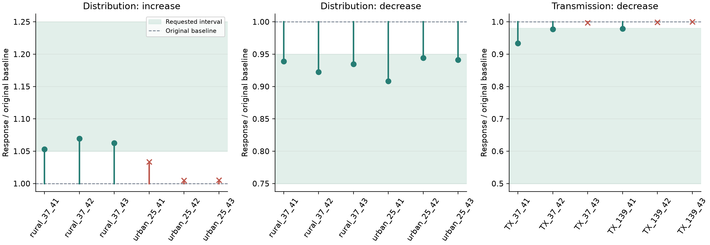
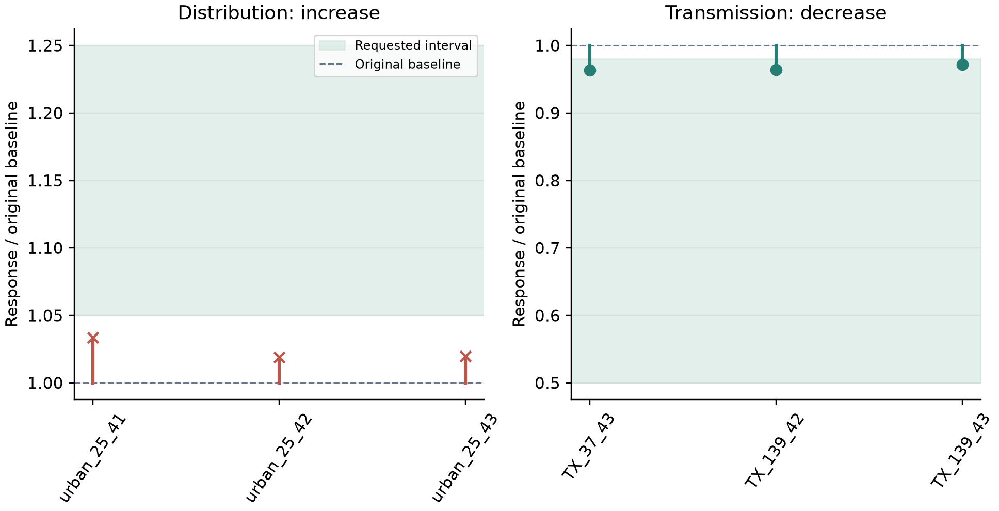

# M88 electrical-response generation: experiment results

> Update, 2026-10-09: Root-cause analysis, fixes and expanded-permission experiments for the three remaining failures are complete; see [failure analysis and research-task scope](response-failure-analysis.md). Three tasks still miss their targets under the original fixed-geometry protocol. A separate experiment allowing bounded spatial scaling passed 3/3; these results cannot be combined into an 18/18 success claim under one protocol. At the time of this update, the milestone was M88-response-v2, with 179 tests passing. The historical record from 2026-10-08 is retained below.

This extension added response targets, frozen probes, candidate prevalidation, LLM selection, target preservation and half-step verification to the existing system. The following records describe actual executions.

## Motivation and design

The experiment asks whether physically justified equipment changes can produce specified electrical responses while preserving the research model's basic conditions. Urban 25-bus and rural 37-bus cases are three-phase unbalanced feeders; transmission cases have 37 and 139 buses. Seeds are 41, 42 and 43. Feeder increase targets are 1.05–1.25 times the original response; decrease targets are 0.75–0.95. Transmission decrease targets are 0.5–0.98.

Both reference models and candidates use actual solvers. Feeder perturbations are 0.01 MW; transmission perturbations are 0.1 or 0.5 MW. Final verification uses half the original step. Each round previews eight candidates, with at most four rounds. Reference buses, topology, coordinates, loads, PV and phases remain fixed.

## Reporting the two rounds

Initial round, 18 tasks: 18/18 selected models passed reference electrical checks, 18/18 preserved their protected contracts, and 12/18 met response targets and passed half-step verification.

Candidate search was improved using the failure records. Distribution search considers legal conductor replacements along the complete relevant path. Transmission uses a DC bus-susceptance rank-one update to predict the effect of parallel circuits on the target before AC acceptance. Only the six initial failures were retested: three transmission targets were resolved, while three urban increase targets remained unmet.

Across the two rounds, 15/18 distinct tasks have a passing record. This is a regression comparison across code versions, not a success-rate estimate from a complete independent experiment with the updated version. Previously successful tasks were not rerun.

| Task | Initial response ratio | Retest response ratio | Latest record passed | Stop reason |
|---|---:|---:|---|---|
| rural_37_41_increase | 1.053195 | Not rerun | True | targets_met |
| rural_37_41_decrease | 0.938817 | Not rerun | True | targets_met |
| rural_37_42_increase | 1.069572 | Not rerun | True | targets_met |
| rural_37_42_decrease | 0.922549 | Not rerun | True | targets_met |
| rural_37_43_increase | 1.062795 | Not rerun | True | targets_met |
| rural_37_43_decrease | 0.934817 | Not rerun | True | targets_met |
| urban_25_41_increase | 1.033406 | 1.033406 | False | search_exhausted |
| urban_25_41_decrease | 0.908443 | Not rerun | True | targets_met |
| urban_25_42_increase | 1.004972 | 1.018971 | False | search_exhausted |
| urban_25_42_decrease | 0.944233 | Not rerun | True | targets_met |
| urban_25_43_increase | 1.005127 | 1.019900 | False | search_exhausted |
| urban_25_43_decrease | 0.941211 | Not rerun | True | targets_met |
| transmission_37_41_decrease | 0.933565 | Not rerun | True | targets_met |
| transmission_37_42_decrease | 0.976871 | Not rerun | True | targets_met |
| transmission_37_43_decrease | 0.997287 | 0.963118 | True | targets_met |
| transmission_139_41_decrease | 0.978562 | Not rerun | True | targets_met |
| transmission_139_42_decrease | 0.998634 | 0.964033 | True | targets_met |
| transmission_139_43_decrease | 1.000000 | 0.971683 | True | targets_met |

## Live end-to-end LLM check

The actual `.env` configuration, `qwen3.7-plus`, completed a natural-language task requesting 37 buses and three villages. The LLM made two selections and committed two changes. The final response was 1.069572 times the original reference; both target and half-step checks passed.

The first call exposed unnormalized phase weights `[1,1,1]` and a conflict between the default 20–30 load points and 37 total buses. A retest succeeded after adding structured compilation constraints, correction context containing the original output, and the `planning_failed` error state. Compiler output errors were not attributed to contradictory user requirements.

This record confirms actual execution of the interface and feedback chain. It does not establish 100% natural-language accuracy.

## Remaining limitations

The three urban increase tasks reached only 1.033406, 1.018971 and 1.019900 times their original responses within four rounds, below the 1.05 lower bound. Even after the search improvements, they stopped at the round limit. This shows that the search had not met the targets; it does not imply physical impossibility.

This version preserves topology and permits only complete catalog equipment changes. Its network models remain usable for research, but some additional response objectives are unmet. Loads were not reduced, targets were not changed, and seeds were not replaced to hide failures.

## Tests and reproduction

The complete curated release suite passed 173 tests. Fourteen added tests cover actual DSS/PYPOWER measurements, target preservation, exact bus counts, web-history reading, rejection of damaged artifacts, compilation-failure states and DC candidate ranking.

```bash
python scripts/run_response_experiments.py --output workspace/response_pilot
python scripts/run_response_experiments.py --output workspace/response_retest --retry-failed-from workspace/response_pilot
```

The reproduction script always uses the code present at execution time. Source digests for this report's initial and retest rounds are in [the experiment summary](assets/response_experiments.json). Running the complete batch on a newer version does not reproduce the initial values obtained with the earlier candidate ranking.

## Data and figures

[Initial CSV](assets/response_initial.csv) · [Retest CSV](assets/response_retest.csv) · [Summary JSON](assets/response_experiments.json)





Complete models and raw probe logs remain in the local directories `workspace/response_pilot_20261008`, `workspace/response_pilot_20261008_retry` and `workspace/response_language_check`. They are excluded from the tracked files in the curated GitHub release.
