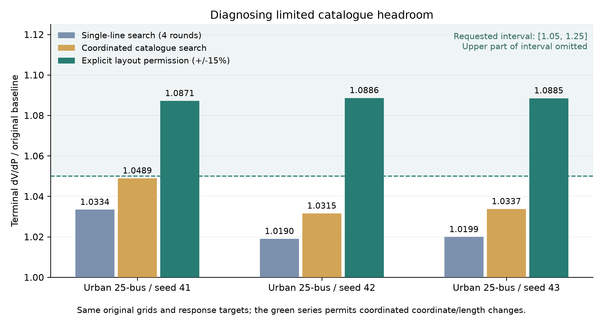

# M88-response-v2: Failure analysis, fixes and research-task scope

> This is the historical v2 experiment record. It retains that version's action scope, 25% software limit and reporting conventions. See the [v3 update](response-design-space.md) for broader design freedoms and new experiments.

Date: 2026-10-09. This report records actual code changes and experiments on only the three remaining urban cases; it is not a complete rerun. The package version remains 0.1.0.

## 1. Where the failures occurred

Three urban three-phase unbalanced feeders, each with 25 buses, 10 kV and 360 kW, required terminal active-power voltage sensitivity of 1.05–1.25 times the original reference. Their original plans permitted only catalog conductor replacement and fixed buses, topology, coordinates, line lengths, loads, PV and phases. Search was limited to four rounds and eight candidates per round.

The failure occurred in response-target search. Reference power flow, electrical checks and protected requirements all passed; there was no LLM connection failure or power-flow convergence failure. The original loop committed four improvements, but each replaced only one conductor segment and did not achieve the required 5% increase.

## 2. Testing alternative explanations

The following diagnostics were performed in order, without first changing targets or seeds:

1. **More rounds.** Only `max_rounds` was changed to 12 in each original plan. The three runs stopped after accepting 6, 7 and 7 changes, respectively, with response ratios of 1.048888, 1.031524 and 1.033708. All remained below target. Search stopped because no new verified improvement candidate remained, so additional rounds alone were insufficient.
2. **Catalog inspection.** Under the existing phase-count, construction-type and source-scope restrictions, three-phase cables offered only five complete parameter combinations, with positive-sequence resistance approximately 0.13055–0.61025 Ω/km. Much of each relevant path already used relatively high-resistance conductors, leaving little room for further adjustment.
3. **Checking for omissions in screening.** At the stalled models, every other legal conductor type was tested individually along the relevant paths, including replacements excluded by the R1 directional filter. No single-segment replacement improved the current target further. Even the closest result was below the current value. This evidence does not support the explanation that the R1 proxy filter merely overlooked an effective conductor type.

These findings concern the given catalog, paths and checked actions. **They are neither an exhaustive enumeration of all equipment combinations nor proof of physical infeasibility for the AC system.** Path-impedance ranges are search diagnostics and cannot be treated as rigorous AC-response bounds.

Original diagnostics remain in the local directory `workspace/response_failure_audit_20261009`; compact evidence is in [response_failure_audit.json](assets/response_failure_audit.json).

## 3. Code fixes

### 3.1 Coordinated conductor candidates

The original single-segment candidates remain available. New candidates coordinate replacements on two, four or all relevant segments of the same target path. They still use legal complete equipment parameter combinations and undergo full AC prevalidation and checks that no individual target worsens. In all three cases, one coordinated change reached the value that previously required 6–7 sequential changes.

### 3.2 Structured stagnation diagnosis

The new `diagnosis.json` reports the stop category, unmet targets, available equipment count, path R1/X1 proxy ranges and suggested next steps. Exhaustion of catalog candidates in the requested direction is labeled `catalogue_direction_exhausted`, with `infeasibility_proven=false` explicitly recorded. The diagnosis is included in the web interface, LangChain results and model package.

Previously, users received only `search_exhausted` and could not determine the cause. The system does not expand equipment sources, change loads or relax targets without authorization when a target remains unmet.

### 3.3 Explicitly permitted spatial scaling

The new `scale_layout` action applies only to `spatial_mst` distribution models with automatically generated coordinates:

- Both `scale_layout` in `allowed_actions` and a numerical `max_layout_scale_change` must be supplied. The action is disabled by default.
- All bus coordinates and lengths of closed lines and normally-open ties scale uniformly about the original source position. Connectivity, bus count, loads, PV, phases, construction type, voltage level and control policy remain unchanged.
- Bounds always refer to the original geometry; successive rounds cannot accumulate changes that evade the limit. Each line must still satisfy the original plan's length range and full electrical checks.
- Explicit user coordinates prohibit scaling. Other geometry generators, including village and empirical-topology generators, do not currently permit this action.
- Natural-language input must explicitly authorize a numerical bound. If the LLM adds coordinate-change permissions on its own, execution stops with `needs_clarification`.

The ±15% allowance in this experiment is an explicit research design choice, not a distribution-planning standard. The version's 25% maximum is also a software boundary, not engineering certification. Changing line lengths changes the electrical model; changing a plotting layout does not.

## 4. Separate reporting for original and expanded permissions

Every original target remains 1.05–1.25 times the reference. Byte-for-byte checks confirmed identical `baseline/model/feeder.json` files across the original retest, updated catalog-diagnosis runs and expanded-permission experiments, and confirmed unchanged targets.

| Seed | Original four-round single-segment search | Updated coordinated catalog replacement | With spatial scaling permitted | Actual scale | Expanded-run power flow / half-step / protected checks |
|---:|---:|---:|---:|---:|---|
| 41 | 1.033406 | 1.048888 | 1.087130 | 1.09 | All passed |
| 42 | 1.018971 | 1.031524 | 1.088596 | 1.09 | All passed |
| 43 | 1.019900 | 1.033708 | 1.088465 | 1.09 | All passed |

Updated catalog replacement met 0/3 response targets, but all 3/3 runs produced explicit stagnation diagnoses and retained electrically feasible models. With expanded layout permissions, 3/3 passed response targets, complete reference checks and independent half-step verification. Each accepted only one change: uniform enlargement by 9%. Response-ratio denominators remained the original models throughout.

**These results cannot turn the original 18-task study into an 18/18 success claim under unchanged restrictions.** Under the original fixed-geometry protocol, 15/18 tasks have passing records across the existing versions. The other three reached their targets in a separate experiment with explicitly changed action permissions. The two sets address different design spaces.

Each round prevalidates eight candidates. The `evaluated_candidates` field includes the original reference, so each case in this batch records nine. All three expanded-permission experiments used deterministic selection to isolate numerical search capability; the LLM was checked separately.

## 5. Live LLM and code checks

One natural-language task for a 25-bus urban feeder used the actual `.env` configuration, `qwen3.7-plus`. The request explicitly permitted uniform spatial scaling by no more than 15% and LLM candidate selection. Compilation succeeded, and one LLM selection chose a legal 9% enlargement. The response ratio was 1.088596; targets, half-step verification and protected checks all passed. Raw calls and results are in `workspace/response_language_v2_check`.

The complete curated suite passed 179 tests in 102.93 seconds. The 20 electrical-response tests cover real active/reactive voltage responses, transmission transfer, coordinated-replacement stagnation diagnosis, authorization gates, fixed-coordinate rejection, cumulative scaling bounds relative to the original geometry, rejection of load and nonuniform-coordinate changes, and existing interfaces and integrity checks.

A single LLM success does not establish accurate handling of arbitrary natural-language requirements. The implementation does not train or update LLM weights online.

## 6. Supported research tasks

The numerical response engine implements three measurements: **d|V|/dP, d|V|/dQ and dP_branch/dP_transfer**. The applications below share these measurements; they are not five completed downstream algorithms.

| Research task | Design or control capability | Deliverables and boundaries |
|---|---|---|
| Cases for distribution voltage-control and reactive-support algorithms | Active- and reactive-power voltage sensitivities at specified buses/phases, using absolute intervals or original-reference multipliers | OpenDSS models and finite-difference evidence; no direct controller design |
| Local voltage effects of PV integration | Voltage response to active injection at specified ports under existing static PV/load conditions | Cases with different voltage sensitivities; no complete PV hosting-capacity solution or annual operating conclusion |
| Three-phase imbalance and phase differences | Probe-phase selection and phase-resolved responses while preserving phases and load allocation | Complete signed response vectors; acceptance currently uses mean or maximum absolute response, without arbitrary interphase-ratio targets |
| Transmission regional transfer and congestion sensitivity | Branch active-power responses to equal injection/withdrawal across two bus groups; mean or maximum limits | MATPOWER models, complete parallel-circuit adjustments and AC acceptance; no complete PTDF-matrix matching or N-1 certification |
| Algorithm comparisons and reproducible paired cases | Retain original and modified models while changing response difficulty within specified permissions | Same buses, topology, loads and phases; coordinates fixed by default, with any scale permission declared separately; complete histories and model hashes |

Existing urban/rural scenarios, three-phase distribution, multi-voltage hierarchies, static PV and transmission generation remain available. Response inverse design currently covers only single-voltage distribution and the defined balanced AC transmission transfers. It does not automatically extend to MV-transformer-LV hierarchies, 8760-hour series, dynamic stability, protection coordination or optimal dispatch.

The supported research claim is that research tasks can be compiled into measurable response constraints, then used to generate and validate network models within explicit design freedoms, with auditable explanations of stagnation under restricted actions. This evidence supports that specific workflow. It does not establish automatic fulfillment of arbitrary research tasks or universally better parameter realism than all baselines.

## 7. Usage and reproduction

```bash
# Explicit expanded design space; does not alter earlier conductor-only plans.
feeder-agents response-design --plan examples/response_urban_25.yaml --id urban_response

# Only replay the three remaining failed tasks, with their original permissions.
python scripts/run_response_experiments.py \
  --retry-failed-from workspace/response_pilot_20261008_retry \
  --output workspace/response_catalogue_check

# Separate experiment, with an explicit additional permission.
python scripts/run_response_experiments.py \
  --retry-failed-from workspace/response_pilot_20261008_retry \
  --layout-scale-change 0.15 \
  --output workspace/response_layout_check
```

Natural-language example:

> Generate an urban three-phase unbalanced feeder with 10 kV, 25 buses and 360 kW, using a spatial_mst layout with automatically generated coordinates. Increase the mean absolute active-power voltage sensitivity at the farthest bus to 1.05–1.25 times its original baseline. Allow compatible catalog conductor replacements and uniform spatial scaling by no more than 15%, while preserving buses, topology, loads and phases. Use LLM agent feedback to select verified candidates.

Complete run models are in the release workspace directories `workspace/response_catalogue_diagnosis_20261009` and `workspace/response_layout_extension_20261009`. They include directly usable OpenDSS models, visualizations, probe results, candidate histories and independent verification. Raw run data are not tracked by Git.

[Results CSV](assets/response_recovery.csv) · [JSON with provenance summaries](assets/response_recovery.json)


